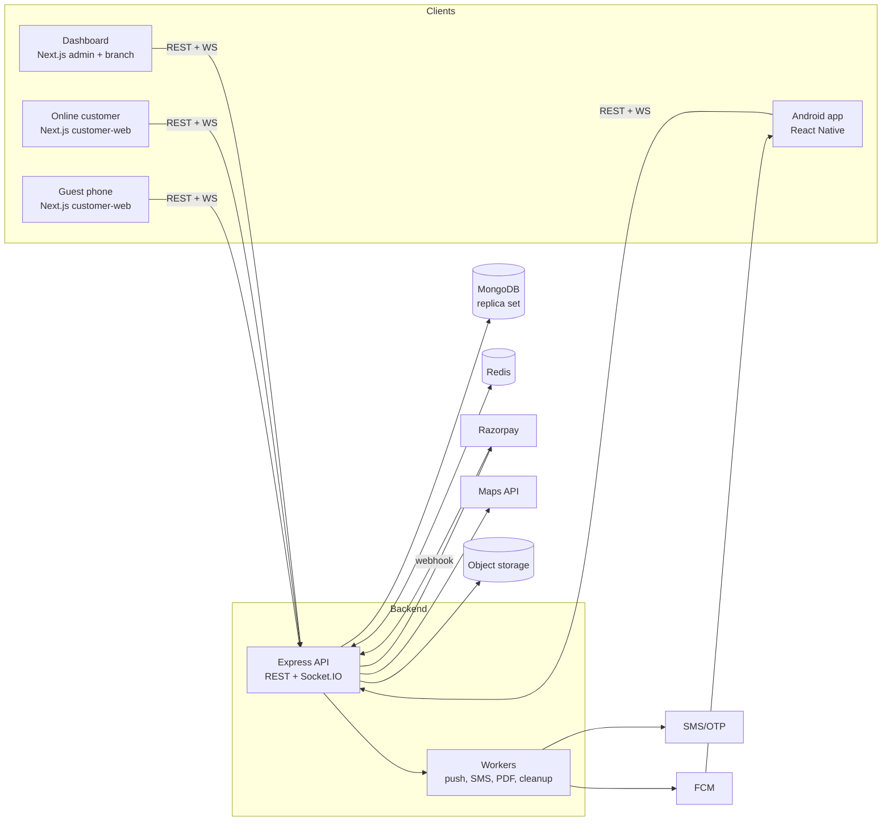

# Noodle Junction — Technical Requirements Document (TRD)

Related: [PRD](01-PRD.md) · [Database](03-DATABASE.md) · [API](04-API.md) · [Events & Notifications](05-EVENTS-AND-NOTIFICATIONS.md) · [Security](09-SECURITY-AND-RBAC.md) · [DevOps](11-DEVOPS.md)

---

## 1. Tech stack

| Layer | Choice | Notes |
|---|---|---|
| Web (dashboard + customer) | **Next.js** (App Router) + TypeScript + Tailwind | Two apps: `dashboard` (admin + branch) and `customer-web` |
| Mobile | **React Native** (Expo dev-client or bare) + TypeScript | Branch staff Android app. Needs native modules (FCM, Notifee) → not Expo Go |
| API | **Node.js + Express** + TypeScript | REST + Socket.IO on the same server |
| Database | **MongoDB** (replica set, e.g. Atlas) + Mongoose | Replica set needed for transactions & change streams |
| Cache / pub-sub | **Redis** | Socket.IO adapter, rate limiting, OTP, short-lived locks |
| Realtime | **Socket.IO** | Rooms per branch / table session / order |
| Push | **Firebase Cloud Messaging (FCM)** | Android; Web Push (VAPID) later for dashboard |
| Payments | **Razorpay** (Orders API + Checkout + Webhooks) | |
| Validation | **Zod** (shared between API, web and app) | |
| Auth | JWT (access) + rotating refresh tokens; phone OTP for customers | |
| Files | S3-compatible storage or Cloudinary | Menu images, logos |
| SMS/OTP | MSG91 / Twilio / Firebase Phone Auth | India needs DLT registration |
| Maps | Google Maps / Mappls / Mapbox (decision pending) | Autocomplete, geocoding, distance |
| PDF | `pdfkit` or Puppeteer | Invoice, QR sheet |
| Tests | Vitest/Jest, Supertest, Playwright, MongoDB Memory Server | |
| Observability | pino logs, Sentry, uptime monitor | |

## 2. High-level architecture



**Deployables**
| Name | Description |
|---|---|
| `api` | Express app: REST, Socket.IO, webhooks. Stateless. |
| `worker` (can start inside `api`, split later) | Queue consumers: push notifications, SMS, PDF, session cleanup, reminders (BullMQ on Redis) |
| `dashboard` | Next.js — `/admin/*` and `/branch/*` route groups, role-guarded |
| `customer-web` | Next.js — QR ordering, delivery/takeaway, reservations |
| `branch-app` | React Native Android app |

## 3. Monorepo layout

```
noodle-junction/
├─ apps/
│  ├─ api/                    # Express + Socket.IO
│  │  └─ src/
│  │     ├─ config/           # env, db, redis, firebase, razorpay
│  │     ├─ modules/          # one folder per domain module (see below)
│  │     │  ├─ auth/
│  │     │  ├─ restaurant/
│  │     │  ├─ branch/
│  │     │  ├─ staff/
│  │     │  ├─ menu-master/
│  │     │  ├─ menu-branch/
│  │     │  ├─ table/
│  │     │  ├─ table-session/
│  │     │  ├─ order/
│  │     │  ├─ payment/
│  │     │  ├─ invoice/
│  │     │  ├─ coupon/
│  │     │  ├─ customer/
│  │     │  ├─ delivery/
│  │     │  ├─ notification/
│  │     │  ├─ reservation/
│  │     │  └─ report/
│  │     ├─ realtime/         # socket server, rooms, emitters
│  │     ├─ middlewares/      # auth, rbac, branchScope, validate, rateLimit, error
│  │     ├─ jobs/             # BullMQ processors
│  │     ├─ utils/
│  │     └─ server.ts
│  ├─ dashboard/              # Next.js (admin + branch)
│  ├─ customer-web/           # Next.js (guest + customer)
│  └─ branch-app/             # React Native
├─ packages/
│  ├─ shared/                 # zod schemas, TS types, enums, constants, money helpers
│  ├─ design-tokens/          # colors, spacing, typography (used by web + RN)
│  └─ eslint-config/
├─ docs/                      # these documents
├─ pnpm-workspace.yaml
└─ turbo.json
```

Each API module folder: `*.routes.ts`, `*.controller.ts`, `*.service.ts`, `*.repo.ts` (or model), `*.schema.ts` (zod), `*.test.ts`. **Controllers are thin; business rules live in services.**

## 4. Multi-branch data isolation (critical)

Rules:
1. Every branch-owned document stores `restaurantId` and `branchId`.
2. For branch users, `branchId` comes **only from the verified JWT** (`req.auth.branchId`), never from body/query/params.
3. A `branchScope` middleware sets `req.scope = { restaurantId, branchId | null }`.
4. All repository functions for branch data require `scope` and always add `{ branchId }` to the filter. Provide a Mongoose helper/plugin `scopedFind(scope)` so a developer cannot forget it.
5. Admin routes (`/admin/*`) may pass an explicit `branchId` param for **read-only reporting** — validated to belong to `restaurantId`.
6. Sockets: the staff socket joins only `branch:{branchId}` from its token. Clients cannot join arbitrary rooms.
7. **Automated tests**: for every branch-scoped endpoint, a test logs in as Branch A and tries to read/modify Branch B resources → must return 404 (not 403, to avoid confirming existence).

## 5. Authentication and sessions

### 5.1 Staff (web + app)
- Login → `accessToken` (JWT, 15 min) + `refreshToken` (opaque random, 30 days, stored hashed in DB, **rotated on every use**, reuse detection revokes the family).
- Web: refresh token in `httpOnly; Secure; SameSite=Lax` cookie. App: refresh token in Keychain/Keystore (`react-native-keychain`).
- JWT claims: `sub, role, restaurantId, branchId?, perms?, iat, exp`.
- Password hashing: `argon2id` (or bcrypt cost 12).
- Login rate limit + temporary lock after repeated failures.

### 5.2 Online customers
- Phone OTP: request → 6-digit OTP (hashed in Redis, 5 min TTL, max 3 tries, resend cooldown) → verify → access + refresh tokens (same scheme as above, `role: CUSTOMER`).

### 5.3 Dine-in guest — **Table Session** (recommended design)

You asked which session approach is best. Recommendation: **a server-side table session + signed cookie**, not a per-device localStorage-only session.

**Why table-scoped, not device-scoped:** at a table, 4 friends scan the same QR. They should all see and add to **one** running order, and it must survive a phone refresh or a friend joining later. So the session belongs to the *table sitting*, and each phone just holds a token that proves it joined.

**QR content**
```
https://order.noodlejunction.in/t/{qrToken}
```
- `qrToken` = random opaque string (e.g. 16-char nanoid) stored on the table document. It is **not** the plain table number, so nobody can edit the URL to order for table 12.
- "Dynamic" = the token is resolved **server-side** to `{ branchId, tableId, tableNumber }`. The printed QR never changes unless staff rotate it.

**Flow**
```
Guest scans QR
 → GET /public/qr/:qrToken           (resolve table + branch, check branch open)
 → POST /public/table-sessions       (start or join)
      • no open session for table → create TableSession(status=OPEN)
      • open session exists       → join it
 ← Set-Cookie: nj_ts=<signed JWT>; HttpOnly; Secure; SameSite=Lax; Path=/
        payload: { sid, tid, bid, did(deviceId), exp }
 → All later guest calls send the cookie; server also checks session.status === OPEN in DB
```
- **Lifetime**: until the table is closed by staff/settlement (hard cap e.g. 6 h idle → auto-expire by a cleanup job).
- **One open session per table** — enforced by a partial unique index `{ tableId } where status = 'OPEN'`.
- **Cookies on iOS Safari**: keep API and web under the same registrable domain (`order.noodlejunction.in` + `api.noodlejunction.in`) so the cookie is first-party. Fallback: also return the token in the response and keep it in `sessionStorage`, sent as `X-Table-Session` header.
- **Anti-abuse**: rate limit per IP + session; optional branch setting `requireStaffConfirmation` (first order of a session shows as "awaiting confirmation" on the counter); optional soft geolocation check (warn/flag if far from branch); rotate QR if leaked; COD orders never bypass this.
- **After close**: cookie is useless (server sees `CLOSED`); scanning again starts a *new* session.

### 5.4 Delivery/takeaway customers
Use the customer account (5.2). They are not table-bound.

## 6. Order engine

### 6.1 Structure
One `Order` document per **sitting** (dine-in) or per **request** (takeaway/delivery). Items are embedded, each tagged with the **round (KOT)** it came from.

```
Order
 ├─ type: DINE_IN | TAKEAWAY | DELIVERY
 ├─ source: QR | POS | WEB
 ├─ tableId / tableSessionId (dine-in)
 ├─ items[]: { itemId, name, qty, unitPrice, variant, addons[], taxRate, roundNo, status, notes }
 ├─ rounds[]: { roundNo, placedAt, placedBy, kotNo }
 ├─ pricing: { subtotal, discount, tax, charges, roundOff, total }
 ├─ payment: { status: UNPAID|PARTIAL|PAID|REFUNDED, paid, balance }
 └─ status / fulfillmentStatus
```

### 6.2 Item state machine (all order types)
```
PENDING ──► PREPARING ──► READY ──► SERVED
   │            │
   └──► CANCELLED ◄──┘   (PREPARING→CANCELLED only staff with approval + reason)
```
| Transition | Who |
|---|---|
| Guest removes item | Only from `PENDING` |
| PENDING → PREPARING → READY | Kitchen |
| READY → SERVED | Waiter/Cashier/Kitchen |
| any → CANCELLED (after PENDING) | Manager approval, reason mandatory, audit logged |

### 6.3 Order lifecycle
- **Dine-in**: `OPEN → BILL_REQUESTED → COMPLETED` (or `CANCELLED`). Food progress is read from item states. `COMPLETED` when fully paid + closed by staff → session closes, table becomes vacant.
- **Takeaway/Delivery** `fulfillmentStatus`:
  `PLACED → ACCEPTED → PREPARING → READY → (OUT_FOR_DELIVERY →) DELIVERED | PICKED_UP`, or `REJECTED / CANCELLED`.
  `PENDING_PAYMENT` exists before `PLACED` when the customer must pay online first.

### 6.4 Add-on to existing order
`POST …/rounds` appends items with `roundNo = last + 1`, recalculates pricing, emits `order:round_added` (kitchen gets a **new KOT**, not a duplicate of the whole order). Uses optimistic concurrency (`version` field) so two phones adding simultaneously both succeed.

### 6.5 Pricing engine (single function, used everywhere)
`calculateOrderTotals(items, coupon, branchSettings, orderType, deliveryQuote)` in `packages/shared`:
1. Line total = (unit + variant + addons) × qty (paise).
2. Subtotal → coupon/manual discount (percent/flat, capped).
3. Tax per line (item `taxRate`, inclusive/exclusive mode) after discount share.
4. Charges: packaging, delivery fee, service charge (if enabled).
5. Round-off to nearest rupee (stored separately).
All money = **integer paise**. Item price/name/tax are **snapshotted** into the order so later menu edits don't change history.

### 6.6 Identifiers
- `orderNo`: `NJ-{BRANCHCODE}-{YYMMDD}-{seq}` (e.g. `NJ-NOI01-260921-0042`), seq per branch per day from a `counters` collection (`findOneAndUpdate $inc`).
- `tokenNo`: short daily number for takeaway counter display.
- `kotNo`: per-branch per-day sequence.
- `invoiceNo`: `NJ/{BRANCHCODE}/{FY}/{seq}` e.g. `NJ/NOI01/2026-27/000123` — sequential, gap-free per branch per financial year (Apr–Mar), assigned only at invoice generation inside a transaction.

## 7. Real-time architecture

- Socket.IO server attached to the Express HTTP server; **Redis adapter** so multiple API instances share rooms.
- Two namespaces:
  - `/staff` — auth via JWT in handshake; auto-joins `branch:{branchId}` (+ `branch:{branchId}:kitchen` if role KITCHEN).
  - `/guest` — auth via table-session token; joins `session:{sid}` and `order:{orderId}`. Online customers join `customer:{customerId}`.
- Services never talk to sockets directly; they call `emitter.emit('order.created', payload)` and `realtime/` translates to socket events and enqueues push jobs. (Keeps logic testable.)
- **No missed events**: each event has `eventId` + `at`. On reconnect the client calls `GET /branch/orders?updatedSince=<lastSeen>` and merges. Dashboard shows a "reconnecting…" banner.
- Heartbeat/ping; auto-reconnect with backoff.
- Dashboard plays an alert sound for `order:new`; browsers require a click first, so show an "Enable sound" prompt at login.
- Full event catalogue: [05-EVENTS-AND-NOTIFICATIONS.md](05-EVENTS-AND-NOTIFICATIONS.md).

## 8. Push notifications (Android, app closed)

- On login the app registers `{ fcmToken, deviceId, platform, branchId, userId }` → `POST /devices/register`. Remove on logout; delete tokens FCM reports invalid.
- On `order.created` for a branch, the worker sends an **FCM message with `priority: high`** to all active staff devices of that branch (roles allowed to receive new orders), payload contains `orderId, orderNo, type, tableNo, total`.
- Android: a dedicated **notification channel** `new_orders` (importance HIGH, custom sound). Use **Notifee** for looping sound / full-screen intent style alerts (verify against current Android 13/14 permission rules: `POST_NOTIFICATIONS`, full-screen intent).
- Reliability measures:
  - Ask users to disable battery optimization for the app during onboarding.
  - Optional Android **foreground service** ("Noodle Junction is listening for orders") to keep the socket alive.
  - **Escalation**: if an order stays `PLACED` for > N seconds (branch setting, default 60 s), re-push, then notify the Branch Manager.
  - Foreground app: socket event plays sound; FCM message suppressed to avoid double alerts (dedupe by `orderId`).
- Web push (VAPID + service worker) for the dashboard is P2.

## 9. Payments (Razorpay)

**Online payment flow (guest / customer / cashier link)**
1. Client: `POST …/payments/razorpay/order` with `{ orderId, amount? }` — server computes the **amount due** itself (never trust client amount) and creates a Razorpay Order (`amount` in paise, `receipt = orderNo`, `notes = { orderId, branchId }`); stores a `Payment(status=CREATED)`.
2. Client opens Razorpay Checkout with `order_id` + public `key_id`.
3. On success the client posts `{ razorpay_order_id, razorpay_payment_id, razorpay_signature }` to `…/payments/razorpay/verify`. Server verifies `HMAC_SHA256(order_id + "|" + payment_id, key_secret)`; marks `PAID`; updates order balance; emits events.
4. **Webhook** `POST /webhooks/razorpay` (`payment.captured`, `payment.failed`, `refund.processed`) — verify `X-Razorpay-Signature` against the **raw body** with the webhook secret. This is the **source of truth** if the customer closes the tab. Processing is **idempotent** (unique index on `razorpayPaymentId`, event id dedupe).
5. For dine-in orders payment reduces `balance`; later add-ons increase the balance again. The order closes only when `balance == 0` (or staff force-settles with COD).

**COD / pay at counter**: `Payment(method=CASH|UPI|CARD, status=PAID)` is recorded by staff (`recordedBy`). For guest "Pay later", order is created with `payment.status = UNPAID`, flagged "pay at counter". For delivery COD: collected by rider, staff marks paid on delivery.

**Refunds**: initiated by Manager via API → Razorpay refund → webhook confirms.

**Idempotency**: `Idempotency-Key` header on order create and payment create; stored in Redis (24 h) → same response on retry.

## 10. Delivery geofencing & nearest-branch assignment

**Data**: `Branch.location` = GeoJSON Point (`[lng, lat]`, `2dsphere` index). `Branch.delivery = { enabled, radiusKm, zone?: GeoJSON Polygon, feeSlabs[], minOrder, avgPrepMins }`.

**Algorithm** (`delivery.service.assignBranch(lat, lng, orderType)`):
1. Query `Branch.aggregate([{ $geoNear: { near, distanceField: 'distM', maxDistance: MAX_RADIUS_M, query: { isActive: true, 'delivery.enabled': true, isPaused: false } } }])`.
2. For each candidate (nearest first): open now (timings) ? point inside zone (polygon `$geoIntersects`, else `distM <= radiusKm*1000`) ?
3. First candidate that passes → assigned. *(P2: take top 3 by straight-line and re-rank by road distance using Distance Matrix API.)*
4. None → `NOT_DELIVERABLE`.
5. Delivery fee from the branch's distance slabs.
6. If the branch **rejects / doesn't accept within timeout**, auto-reassign once to the next eligible branch and notify customer; then fall back to manual admin reassign.

**Takeaway**: customer chooses a branch; list sorted by distance using browser geolocation (fallback: manual area/pincode search).

**Address input**: map pin + autocomplete; store `{ label, line1, landmark, lat, lng, pincode }`. Validate lat/lng server-side; assignment always runs **server-side** — the client never picks the branch for delivery.

## 11. Menu architecture (master → branch copy)

- `MasterCategory`, `MasterItem` (with `variants[]`, `addonGroups[]`).
- On **branch creation** (or "Import from master"), a service copies them into `BranchCategory` / `BranchItem`, each storing `masterItemId` (link) and full values (name, price, tax, etc.). After copy, branch edits **never** touch the master.
- Branch-owned items have `masterItemId = null`, `isCustom = true`.
- Branch overrides: `price`, `isAvailable`, `sortOrder`, `isHidden`. Master price change does **not** overwrite branch prices; P2 "sync" feature shows a diff and lets manager choose.
- Copy runs in a transaction and is idempotent (skip items already linked).
- Customer menu endpoint reads **only** branch collections, with a short Redis/HTTP cache (30–60 s) invalidated by `menu.updated` events; availability changes are pushed live over the guest socket.

## 12. Invoicing and tax

- Invoice generated from an order snapshot (`Invoice` collection) inside a transaction: allocate `invoiceNo` → save → mark order billed.
- Contains: restaurant/branch legal name, address, **GSTIN**, FSSAI, invoice no/date, table/order info, line items with tax split (CGST/SGST for intra-state), discount, charges, round-off, total, payment mode(s).
- PDF for download/print + 58/80 mm thermal print stylesheet (browser print in v1; ESC/POS/Bluetooth from the app is P2).
- Settled invoices are immutable; corrections via credit note (P1) — never edit.
- Tax rates/SAC/HSN and inclusive vs exclusive pricing are configuration; **confirm with your CA**.

## 13. Reservations (Phase 3)
Slot engine per branch: `slotMinutes`, `openFrom/To`, `maxAdvanceDays`, `minAdvanceMins`. Availability = tables with enough capacity not overlapping an existing confirmed reservation. Confirmed reservations put the table in `RESERVED` state on the live board 15–30 min before the slot. Seating a reservation opens a table session.

## 14. Caching, performance, background jobs
- Redis: rate limits, OTP, idempotency keys, menu cache, socket adapter.
- BullMQ jobs: `push.send`, `sms.send`, `invoice.pdf`, `session.expire`, `order.autoEscalate`, `reservation.reminder`, `report.rollup`.
- Indexes: see [03-DATABASE.md](03-DATABASE.md). Paginate all lists (cursor or `page/limit`, max 100).

## 15. Error handling & logging
- Single error class `AppError(code, httpStatus, message, details)`; global handler returns the envelope in [04-API.md](04-API.md).
- `pino` structured logs with `requestId`, `userId`, `branchId`; never log passwords, tokens, OTPs, card data.
- Sentry for API, dashboard, customer web and app.
- Audit log collection for sensitive actions.

## 16. Configuration (environment variables)
See [11-DEVOPS.md](11-DEVOPS.md#environment-variables) for the full list.

## 17. Coding standards
- TypeScript strict; ESLint + Prettier; Conventional Commits; PR template with "isolation test added?" checkbox.
- Zod schema is the single source of truth for request validation and shared types.
- No business logic in controllers; no direct DB calls outside repos/services.
- Money as integer paise, dates in UTC ISO strings, IDs as strings in API.
- API versioned under `/api/v1`.

## 18. Key technical decisions log

| # | Decision | Reason |
|---|---|---|
| D1 | Table-scoped session + signed cookie | Multiple phones per table share one order; survives refresh |
| D2 | Opaque `qrToken`, resolved server-side | Prevents URL tampering; allows rotation |
| D3 | Items embedded in `orders` with round numbers | Single read for live board; simple atomic add-on |
| D4 | Item-level status machine | Enables the "remove only if not prepared" rule precisely |
| D5 | Money in paise integers | No floating-point errors |
| D6 | Razorpay webhook is source of truth | Handles closed tabs/network drops |
| D7 | Master → branch **copy** (with link) | Matches "copy when a branch is created", allows branch independence |
| D8 | Socket.IO + Redis adapter | Simple rooms model, scales horizontally |
| D9 | FCM high-priority + Notifee channel | Closed-app alerts on Android |
| D10 | Server-side nearest-branch assignment | Client cannot spoof branch |
| D11 | Monorepo with shared zod package | One validation contract for API/web/app |