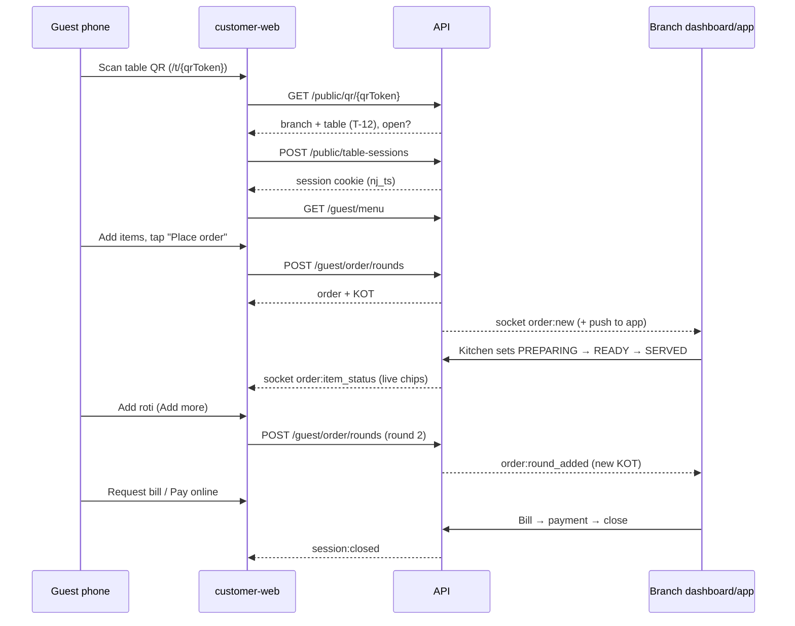
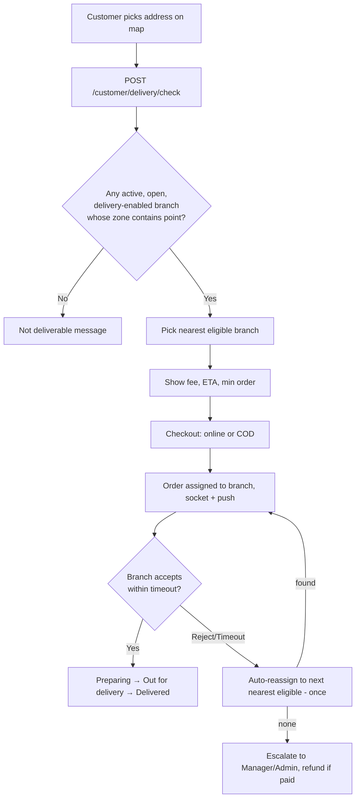

# Noodle Junction — Business Rules & Workflows

Related: [PRD](01-PRD.md) · [TRD](02-TRD.md) · [API](04-API.md)

---

## 1. Roles at a glance
- **Restaurant Admin** — restaurant-level setup & reporting. No order operations.
- **Branch Manager** — everything in own branch, approvals (cancel prepared items, discounts, refunds).
- **Cashier** — orders, POS, billing, payments.
- **Kitchen** — sees tickets, marks Preparing/Ready.
- **Waiter** — live tables, add items, mark served.

## 2. Flow A — Dine-in via QR (happy path)



**Rules**
1. The table is taken from the session — the guest can never choose or change the table.
2. First order of a session creates the `Order`; every later order appends a **round** to the same order.
3. If branch `autoAcceptQrOrders = true` the KOT goes straight to the kitchen. If `requireStaffConfirmationFirstOrder = true`, the **first** order of a new session shows as *Awaiting confirmation* and is sent to the kitchen only after a cashier confirms (protects against prank orders). Later rounds are auto-accepted.
4. Payment choice at order time: **Pay now** (Razorpay) or **Pay at counter** (COD). Guest can also pay later from the same screen.

## 3. Flow B — Add-on to an existing table order

| Situation | What happens |
|---|---|
| Guest scans and adds via phone | New round on the same order; kitchen gets a new KOT |
| Guest asks waiter for roti | Waiter/Cashier opens **Live Tables → T-12 → Add items** (or POS with table T-12) → same behaviour |
| Guest already paid part of bill, then adds items | Order total increases; `balance = total − paid`; guest pays only the balance |
| Guest has **left** and calls/returns later for something | Session/order is closed → this is a **new order**. Staff creates a new POS order (optionally linking customer phone). Reopening a closed order is not allowed; Manager can cancel and re-bill via credit note if there was an error |
| Guest moves to another table | Staff uses **Transfer table**; the session follows the order; old table → vacant, new table → occupied |
| Two groups merge | **Merge** orders (P1): items are moved into the target order, source order closed |

## 4. Item removal / modification rules (core rule)

| Item status | Guest (QR) can remove/reduce? | Cashier/Waiter | Manager |
|---|---|---|---|
| `PENDING` (not yet started) | ✅ Yes | ✅ Yes | ✅ |
| `PREPARING` | ❌ `ITEM_LOCKED` | ❌ (request approval) | ✅ with reason (marked as *wastage*) |
| `READY` | ❌ | ❌ | ✅ with reason |
| `SERVED` | ❌ | ❌ | ✅ only as bill correction with reason |
| `CANCELLED` | — | — | — |

- Increasing quantity of an existing line is treated as **adding a new line/round** (so kitchen sees the extra as a new ticket).
- Every cancellation after `PENDING` records `cancelledBy`, `reason`, `approvedBy` and writes an audit log.
- If the last PENDING item is removed and nothing else exists, the order stays OPEN (table still occupied) until staff cancel/close it.
- If a paid item is removed, the amount becomes credit/refund on the order (`balance` may go negative → refund action shown).

## 5. Flow C — Manual order (POS)

1. Cashier picks type (Dine-in / Takeaway / Delivery).
2. Dine-in: select table (or "Counter / no table"). If the table has an open order → items are **appended**.
3. Add items (search, categories, quick keys), variants, notes.
4. Optional: customer name/phone; coupon or manager-approved manual discount.
5. **Send to kitchen** (KOT) — or *Bill only* for counter sales where food is handed immediately.
6. **Bill** → invoice generated → payment (cash/UPI/card/split/Razorpay link).
7. **Close** → table vacant, session closed.

Invoice generation rules:
- Sequential per branch per financial year (Apr–Mar), no gaps, allocated in a transaction.
- After invoice issue, the order is immutable; corrections → cancel invoice + new invoice or credit note (Manager).
- Bill can be generated **before** payment (dine-in "bill requested"); payment can complete later.

## 6. Flow D — Takeaway

1. Customer logs in (OTP) → selects branch (nearest first) → menu → checkout.
2. Pay online or pay at pickup.
3. Branch: `PLACED → ACCEPTED (ETA) → PREPARING → READY → PICKED_UP`.
4. Customer sees live status; token number shown for pickup.
5. Unaccepted beyond timeout → escalation alert; branch may reject with reason → refund if paid.

## 7. Flow E — Delivery with geofencing



Rules:
- Assignment is **server-side** using the stored branch location and zone.
- Menu/prices shown are the **assigned branch's** menu; if an item isn't on that branch, it's flagged unavailable at quote.
- Order stays **isolated** to the assigned branch; after reassignment it disappears from the first branch.
- Delivery fee by distance slab; free-delivery threshold optional; minimum order enforced.
- COD: rider collects; branch marks paid on delivery.

## 8. Table lifecycle

```
VACANT ──scan/first order or staff opens──► OCCUPIED ──bill requested──► BILL_REQUESTED
   ▲                                             │                             │
   └──────────── close (paid & settled) ◄────────┴─────────────────────────────┘
VACANT ──reservation window──► RESERVED ──seat──► OCCUPIED
Any ──manager──► DISABLED (out of service)
```
- A table with an OPEN session cannot be deleted/disabled.
- Sessions with no activity for `N` hours (default 4) are flagged to staff and auto-expired only if the order has no unpaid balance (otherwise they're highlighted for manual close).

## 9. Payment rules

| Rule | Detail |
|---|---|
| Amount source | Server computes amount due; client-provided amounts are ignored |
| Partial payments | Allowed for dine-in (per round or split bill); `balance = total − Σpaid` |
| Overpayment | Not allowed online; at counter, extra cash is change |
| Razorpay success | Verified by signature + webhook; idempotent by `razorpayPaymentId` |
| Failed payment | Order stays unpaid; guest can retry or choose counter |
| COD (dine-in) | "Pay at counter" — staff records mode (cash/UPI/card) |
| COD (delivery) | Collected by rider; staff marks paid on delivery |
| Refund | Manager only; full/partial; reason mandatory; Razorpay refund for online payments |
| Close order | Requires `balance = 0` (Manager may force-close with reason → logged as *written off*) |

## 10. Coupon rules
- One coupon per order (no stacking) in v1. Manual manager discount and coupon cannot combine unless Manager explicitly allows (flag).
- Evaluated server-side on every order change; if the order no longer satisfies the rules (e.g., min order after removal) and the order is unpaid, coupon is removed with a message.
- If the order has been (partially) paid, applied coupon is **frozen** at the moment of payment.
- Discount is applied on subtotal before tax; capped by `maxDiscountPaise`; never makes total negative.
- Limits checked: validity window, day/hour rules, total usage, per-user usage (by phone/customer), branch scope, order type, first-order-only.
- Redemption is recorded when payment is complete (or order confirmed for COD).

## 11. Menu rules
- Master → branch import copies items; branch changes are independent.
- Branch can hide or make unavailable; cannot delete a master link but can hide.
- Out-of-stock item: cannot be added to cart; if already in a pending cart, checkout returns `ITEM_UNAVAILABLE` for that line.
- Items in existing orders are snapshots — later price changes don't alter them.
- Scheduled items (breakfast/lunch) only orderable inside their window.

## 12. Notifications rules
- Every new order/round: socket → all staff of branch; push → devices of allowed roles.
- If not acknowledged in `acceptTimeoutSeconds`, re-alert then escalate to Manager.
- Duplicate alerts suppressed by `eventId`.

## 13. Access & isolation rules
- Branch users only ever see their own branch's data. Requests that reference another branch's IDs return `404`.
- Admin sees aggregated reports across branches but doesn't operate orders.
- Guests see only their own table session's order.
- Online customers see only their own orders.

## 14. Edge cases catalogue

| # | Case | Behaviour |
|---|---|---|
| 1 | Guest scans QR when branch closed | Friendly "Closed – opens at …" page; no session |
| 2 | Same QR scanned by 4 phones | All join one session; each sees the same order |
| 3 | Guest reloads page / phone locks | Cookie restores session; socket reconnects; state refetched |
| 4 | Cookies blocked | Fallback `sessionStorage` token via header; if both fail → re-scan (same session is rejoined) |
| 5 | Two phones add items at the same moment | Both succeed (separate rounds), optimistic version retry |
| 6 | Guest tries to remove a PREPARING item via API tampering | `ITEM_LOCKED` (server enforced) |
| 7 | QR photographed and used from home | If staff confirmation is enabled the order waits; optional geolocation flag; rotate QR if abused |
| 8 | Payment success but browser closed | Webhook marks paid |
| 9 | Webhook arrives before verify call | Verify call finds it already PAID → returns success |
| 10 | Item price changed while guest has cart open | Quote re-prices; guest sees "price updated" before confirm |
| 11 | Table order still open after guest left | Highlighted "idle" on live board; staff closes |
| 12 | Delivery address on the edge of zone | Uses stored zone/radius; deterministic |
| 13 | Nearest branch closed/paused | Next eligible branch |
| 14 | Kitchen marks READY by mistake | Kitchen can revert one step within 2 min (logged) |
| 15 | Internet drop at branch | Dashboard shows offline banner; on reconnect catches up via `updatedSince`; POS retries with idempotency keys |
| 16 | Manager cancels order with paid amount | Refund flow required |
| 17 | Duplicate order from double-tap | Idempotency-Key returns the same order |
| 18 | Staff account deactivated while logged in | `system:force_logout`, tokens revoked |

## 15. Glossary
| Term | Meaning |
|---|---|
| KOT | Kitchen Order Ticket — one per round |
| Round | A batch of items placed together (first order or an add-on) |
| Table session | One sitting at a table; may contain many phones, exactly one order |
| Master menu | Restaurant-wide template menu |
| Branch menu | A branch's own copy |
| Balance | Order total minus payments received |